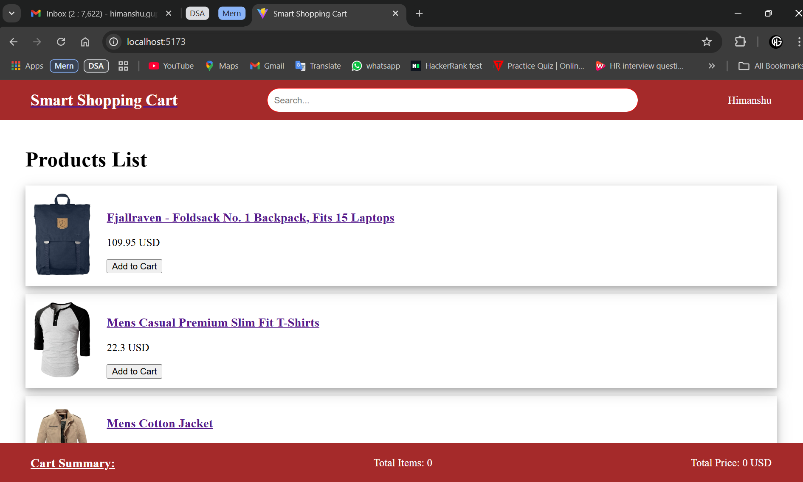
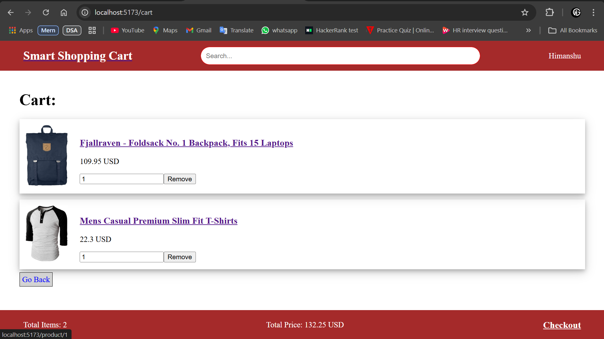
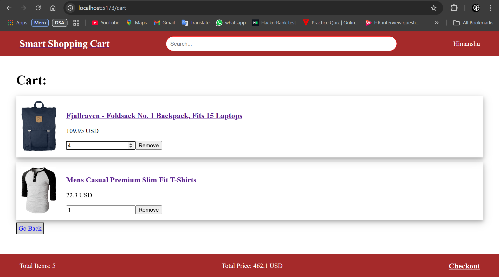
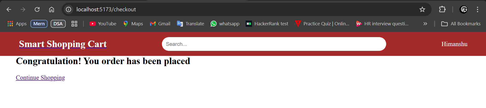
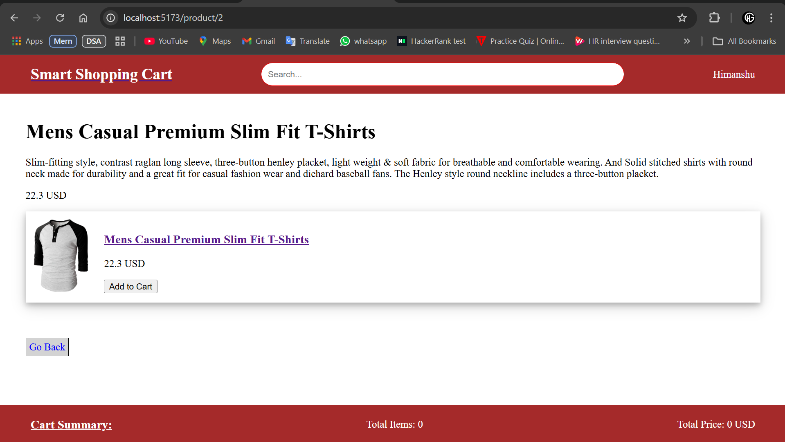
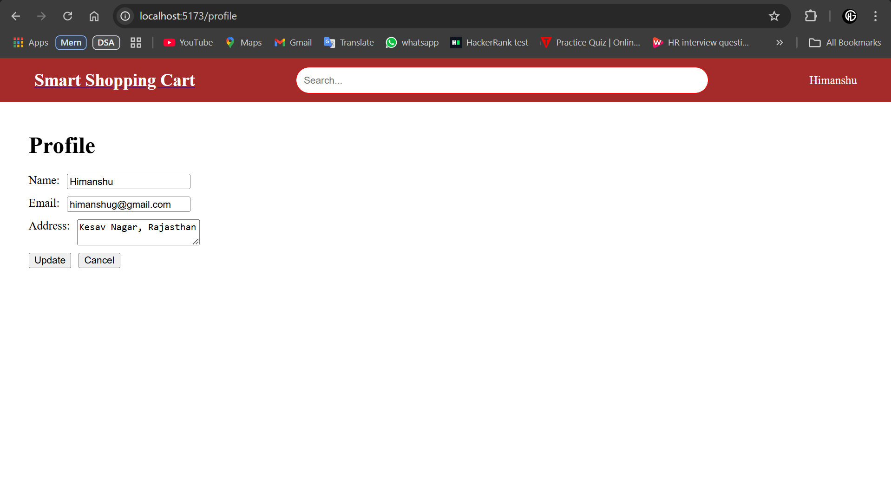
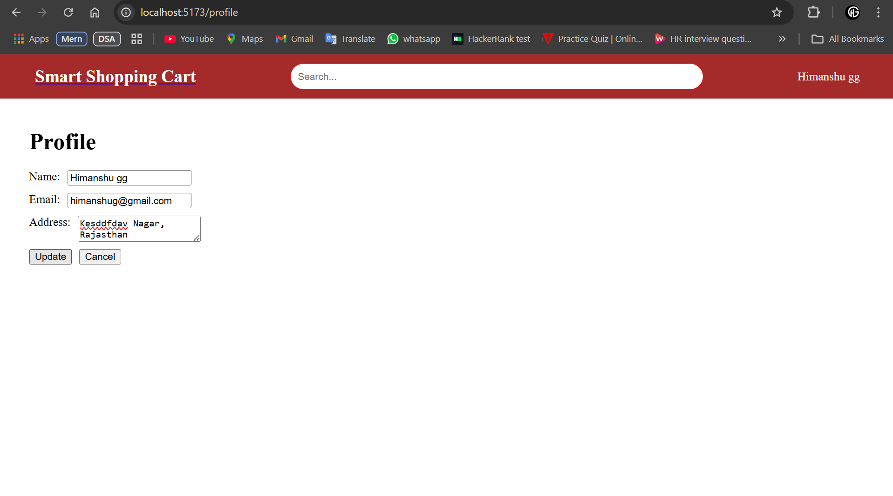

# "Smart Shopping Cart" Application

### Objective: Build an interactive E-commerce Shopping Cart App that uses React hooks, Context API, routing, Redux for state management, and conditional rendering.

# App Requirements:
 
    Home Page:
        Display a list of products with their names, images, prices, and an "Add to Cart" button.
        Show a Search bar to filter products by name.
        Display a Cart Summary with the total items and total price.
        Navigate to a Product Details page on clicking a product.
        
    Product Details Page:
        Show detailed information about the selected product.
        Include an "Add to Cart" or "Remove from Cart" button based on the product’s cart status.
        Use conditional rendering to show the right button.
        Add a "Go Back" button to return to the Home page.
        
    Cart Page:
        Display all products added to the cart, with each product showing the name, price, and quantity.
        Allow the user to update the quantity or remove products from the cart.
        Show the total price and total items in the cart.
        Include a Checkout button that clears the cart and navigates to a confirmation page.

    Checkout Confirmation Page:
        Display a message confirming that the order has been placed.
        Show a "Continue Shopping" button that redirects to the Home page.
        
# Technical Requirements

    Routing (React Router):
        /: Home page with product list.
        /product/:id: Product Details page for the selected product.
        /cart: Cart page showing selected products.
        /checkout: Checkout confirmation page.
        
    State Management (Redux):
        Use Redux for managing the cart state globally.
        Cart state should include the productId, name, price, quantity, and total price.
        Use actions for adding to cart, updating quantity, and removing from cart.

    Global User Context (Context API):
        Create a UserContext to store user information like username, email, and address.
        Display the logged-in user’s name on the Home and Cart pages.
        Allow the user to update their profile information in a Profile Page (a separate route at /profile).

    Hooks:
        Use useState for local states (e.g., search bar, product filter).
        Use useEffect to fetch the initial product list from a mock API or hardcoded data.
        Use useContext to access user information from UserContext.
        Use useSelector and useDispatch to manage and interact with the cart state in Redux.

    Conditional Rendering:
        Show "Add to Cart" or "Remove from Cart" button based on product status.
        Display a message in the Cart page if no products are in the cart.
        Show the "Checkout" button only if there’s at least one product in the cart.
        On the Checkout Confirmation page, show a "Continue Shopping" button after checkout.

# Final Screenshots
Home Page   
Cart Summary Home  
Cart Page  
Quantity on Cart page  
Checkout Page  
Product Details Page:  
Profile Page:  
Profile Update:  
